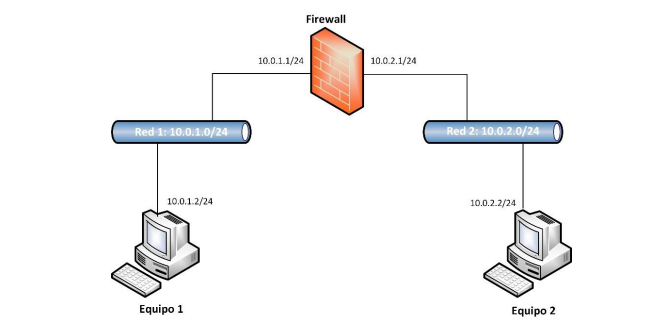

[Firewall ipfw in FreeBSD](https://unix.stackexchange.com/questions/440436/firewall-ipfw-in-freebsd)

2020-08-08  deligeer  <geerdeli@aliyun.com>

Asked 2 years, 3 months ago
Active 1 year, 11 months ago
Viewed 723 times

I have a doubt respect to the functionality of the IPFW firewall in FreeBSD. My scenario is the following: 

enter image description here

All these machines are running FreeBSD, and all of them are virtual machines. The thing is that I don't understand one thing. If I add a rule in IPFW in the firewall machine to block pings from machine 2 to machine 1, I don't know why this block is bidirectional. I mean, I put this rule:

ipfw add 02000 deny icmp from 10.0.2.2 to 10.0.1.2
With this I understand that the firewall will block any ICMP packet coming from 10.0.2.2 (machine on the right in the picture) to 10.0.1.2 (machine on the left in the picture), but what really happens is that ok, machine 2 cannot ping to machine 1, but machine 1 cannot ping machine 2 either! Why is that? The rules of IPFW are the following: enter image description here

Pictures of the pings: enter image description here enter image description here

freebsd ping ipfw
share  improve this question   follow  
edited Apr 29 '18 at 15:19

Gilles 'SO- stop being evil'
639k154154 gold badges13231323 silver badges18311831 bronze badges
asked Apr 27 '18 at 14:23

victor26567
12133 bronze badges
2
What evidence do you have that the ICMP packets from machine 1 do not make it through the firewall to machine 2? Please provide details.  ping would not be successful, since the return packet from machine 2 would not make it through the firewall to machine 1. - cherdt Apr 27 '18 at 14:45
1
Ahh thats truee, the response of machine 2 will not arrive to machine 1 because of firewall. Thanks!! - victor26567 Apr 27 '18 at 14:54
1
Don't post a screenshot of text. Copy-paste the text. - Gilles 'SO- stop being evil' Apr 29 '18 at 15:20
@cherdt Since your comment is a good answer please added as one. - Raphael Ahrens May 1 '18 at 9:07
add a comment
2 Answers
Active
Oldest
Votes
 
 2
 
 You can confirm whether or not machine 2 is receiving and responding to ICMP packets using tcpdump, e.g.:
 
 sudo tcpdump -i eth0 icmp
 In the case you have described, ping would not be successful because the return packet from machine 2 would be blocked by the firewall on machine 1.
 
 share  improve this answer   follow  
 answered May 2 '18 at 15:29
 
 cherdt
 1,13611 gold badge77 silver badges1717 bronze badges
 add a comment
  
  2
  
  If you are pinging 10.0.2.2 FROM 10.0.2.1, then the ping reply (to 10.0.2.1 FROM 10.0.2.2), is ALSO an icmp packet, so it matches the rule and is blocked.
  
  To get your desired behaviour, change the rule to:
  
  ipfw add 02000 deny icmp from 10.0.2.2 to 10.0.1.2 icmptypes 8
  
  Where type 8 is 'echo-request', and type 0 is 'echo-reply'.
  
  Or add a rule before 2000 to allow replies only, and continue to block all other ICMP packets: 
  ipfw add 01999 allow icmp from 10.0.2.2 to 10.0.1.2 icmptypes 0
  ipfw add 02000 deny icmp from 10.0.2.2 to 10.0.1.2
